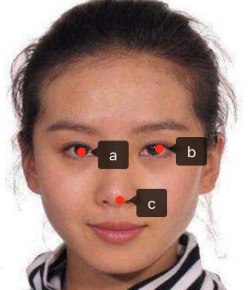
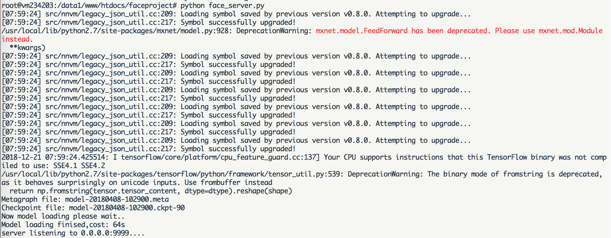
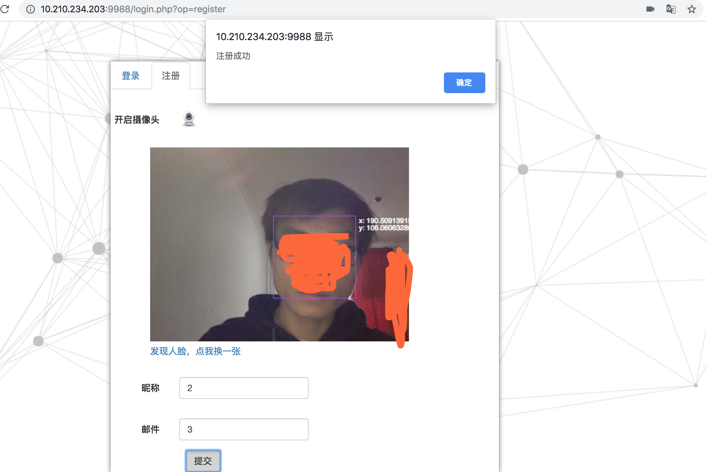
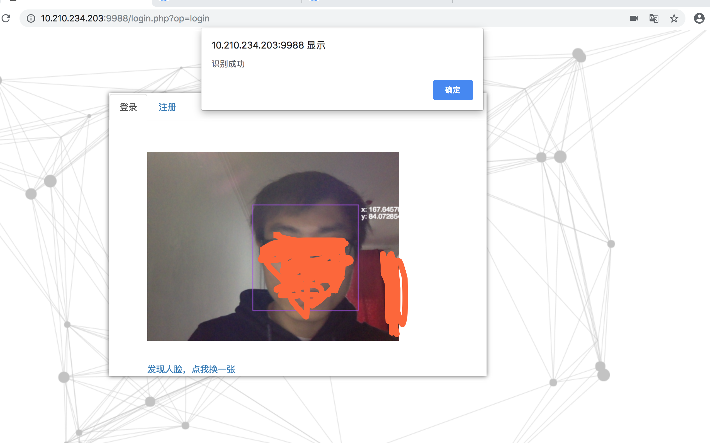

# 基于mtcnn与facenet实现人脸登录系统

本文主要介绍了系统涉及的人脸检测与识别的详细方法，该系统基于python2.7.10/opencv2/tensorflow1.7.0环境，实现了从摄像头读取视频，检测人脸，识别人脸的功能
由于模型文件过大，git无法上传，整个项目放在百度云盘，地址:https://pan.baidu.com/s/1TaalpwQwPTqlCIfXInS_LA


人脸识别是计算机视觉研究领域的一个热点。目前，在实验室环境下，许多人脸识别已经赶上（超过）人工识别精度（准确率：0.9427~0.9920），比如face++,DeepID3，FaceNet等（详情可以参考：基于深度学习的人脸识别技术综述）。但是，由于光线，角度，表情，年龄等多种因素，导致人脸识别技术无法在现实生活中广泛应用。本文基于python/opencv/tensorflow环境，采用FaceNet（LFW：0.9963 ）为基础来构建实时人脸检测与识别系统，探索人脸识别系统在现实应用中的难点。下文主要内容如下 ：

1. 利用htm5 video标签打开摄像头采集头像并使用jquery.faceDeaction组件来粗略检测人脸
2. 将人脸图像上传到服务器，采用mtcnn检测人脸
3. 利用opencv的仿射变换对人脸进行对齐，保存对齐后的人脸
4. 采用预训练的facenet对检测的人脸进行embedding，embedding成512维度的特征；
5. 对人脸embedding特征创建高效的annoy索引进行人脸检测


### 人脸采集
采用html5 video标签可以很方便的实现从摄像头读取视频帧，下文代码实现了从摄像头读取视频帧，faceDection识别人脸后截取图像上传到服务器功能
在html文件中添加video，canvas标签
```$xslt
<div class="booth">
    <video id="video" width="400" height="300" muted class="abs" ></video>
    <canvas id="canvas" width="400" height="300"></canvas>
  </div>
```
打开网络摄像头
```$xslt
var video = document.getElementById('video'),
var vendorUrl = window.URL || window.webkitURL;
//媒体对象
navigator.getMedia = navigator.getUserMedia || navagator.webkitGetUserMedia || navigator.mozGetUserMedia || navigator.msGetUserMedia;
navigator.getMedia({video: true, //使用摄像头对象audio: false  //不适用音频}, function(strem){
    video.src = vendorUrl.createObjectURL(strem);
    video.play();
});
```
利用jquery的facetDection组件检测人脸

> $('#canvas').faceDetection()

检测出人连脸的话截图，并把图片转换为base64的格式，方便上传

```$xslt
context.drawImage(video, 0, 0, video.width, video.height);
var base64 = canvas.toDataURL('images/png');
```

将base64格式的图片上传到服务器
```$xslt
//上传人脸图片
function upload(base64) {
  $.ajax({
      "type":"POST",
      "url":"/upload.php",
      "data":{'img':base64},
      'dataType':'json',
      beforeSend:function(){},
      success:function(result){
          console.log(result)
          img_path = result.data.file_path
      }
  });
}
```
图片服务器接受代码，php语言实现
```$xslt
function base64_image_content($base64_image_content,$path){
    //匹配出图片的格式
    if (preg_match('/^(data:\s*image\/(\w+);base64,)/', $base64_image_content, $result)){
        $type = $result[2];
        $new_file = $path."/";
        if(!file_exists($new_file)){
            //检查是否有该文件夹，如果没有就创建，并给予最高权限
            mkdir($new_file, 0700,true);
        }
        $new_file = $new_file.time().".{$type}";
        if (file_put_contents($new_file, base64_decode(str_replace($result[1], '', $base64_image_content)))){
            return $new_file;
        }else{
            return false;
        }
    }else{
        return false;
    }
}
```

### 人脸检测

人脸检测方法有许多，比如opencv自带的人脸Haar特征分类器和dlib人脸检测方法等。
对于opencv的人脸检测方法，有点是简单，快速；存在的问题是人脸检测效果不好。正面/垂直/光线较好的人脸，该方法可以检测出来，而侧面/歪斜/光线不好的人脸，无法检测。因此，该方法不适合现场应用。对于dlib人脸检测方法 ，效果好于opencv的方法，但是检测力度也难以达到现场应用标准。
本文中，我们采用了基于深度学习方法的mtcnn人脸检测系统（mtcnn：Joint Face Detection and Alignment using Multi-task Cascaded Convolutional Neural Networks）。mtcnn人脸检测方法对自然环境中光线，角度和人脸表情变化更具有鲁棒性，人脸检测效果更好；同时，内存消耗不大，可以实现实时人脸检测。本文中采用mtcnn是基于python和tensorflow的实现（代码来自于davidsandberg，caffe实现代码参见：kpzhang93）
```$xslt
model= os.path.abspath(face_comm.get_conf('mtcnn','model'))
class Detect:
    def __init__(self):
        self.detector = MtcnnDetector(model_folder=model, ctx=mx.cpu(0), num_worker=4, accurate_landmark=False)
    def detect_face(self,image):
        img = cv2.imread(image)
        results =self.detector.detect_face(img)
        boxes=[]
        key_points = []
        if results is not None:  
            #box框
            boxes=results[0]
            #人脸5个关键点
            points = results[1]
            for i in results[0]:
                faceKeyPoint = []
                for p in points:
                    for i in range(5):
                        faceKeyPoint.append([p[i], p[i + 5]])
                key_points.append(faceKeyPoint)
        return {"boxes":boxes,"face_key_point":key_points}
```
具体代码参考fcce_detect.py

### 人脸对齐

有时候我们截取的人脸了头像可能是歪的，为了提升检测的质量，需要把人脸校正到同一个标准位置，这个位置是我们定义的，假设我们设定的标准检测头像是这样的



假设眼睛，鼻子三个点的坐标分别是a(10,30) b(20,30) c(15,45)，具体设置可参看config.ini文件alignment块配置项

采用opencv仿射变换进行对齐,获取仿射变换矩阵
```
dst_point=【a,b,c】
tranform = cv2.getAffineTransform(source_point, dst_point)
```

仿射变换:
> img_new = cv2.warpAffine(img, tranform, imagesize)

具体代码参考face_alignment.py文件

### 产生特征

对齐得到后的头像，放入采用预训练的facenet对检测的人脸进行embedding，embedding成512维度的特征，以(id,vector)的形式保存在lmdb文件中
```$xslt
 facenet.load_model(facenet_model_checkpoint)
 images_placeholder = tf.get_default_graph().get_tensor_by_name("input:0")
 embeddings = tf.get_default_graph().get_tensor_by_name("embeddings:0")
 phase_train_placeholder = tf.get_default_graph().get_tensor_by_name("phase_train:0")

 face=self.dectection.find_faces(image)
 prewhiten_face = facenet.prewhiten(face.image)
 # Run forward pass to calculate embeddings
 feed_dict = {images_placeholder: [prewhiten_face], phase_train_placeholder: False}
 return self.sess.run(embeddings, feed_dict=feed_dict)[0]
```

具体代码可参看face_encoder.py


人脸特征索引:

人脸识别的时候不能对每一个人脸都进行比较，太慢了，相同的人得到的特征索引都是比较类似，可以采用KNN分类算法去识别,这里采用是更高效annoy算法对人脸特征创建索引，annoy索引算法的有个假设就是，每个人脸特征可以看做是在高维空间的一个点，如果两个很接近(相识)，任何超平面
都无法把他们分开，也就是说如果空间的点很接近，用超平面去分隔，相似的点一定会分在同一个平面空间（具体参看:https://github.com/spotify/annoy）

```$xslt
#人脸特征先存储在lmdb文件中格式(id,vector),所以这里从lmdb文件中加载
lmdb_file = self.lmdb_file
if os.path.isdir(lmdb_file):
    evn = lmdb.open(lmdb_file)
    wfp = evn.begin()
    annoy = AnnoyIndex(self.f)
    for key, value in wfp.cursor():
        key = int(key)
        value = face_comm.str_to_embed(value)
        annoy.add_item(key,value)

    annoy.build(self.num_trees)
    annoy.save(self.annoy_index_path)
```
具体代码可参看face_annoy.py

### 人脸识别
经过上面三个步骤后，得到人脸特征，在索引中查询最近几个点并就按欧式距离，如果距离小于0.6（更据实际情况设置的阈值）则认为是同一个人，然后根据id在数据库查找到对应人的信息即可

```
#根据人脸特征找到相似的
def query_vector(self,face_vector):
    n=int(face_comm.get_conf('annoy','num_nn_nearst'))
    return self.annoy.get_nns_by_vector(face_vector,n,include_distances=True)
```

具体代码可参看face_annoy.py

### 安装部署

建表，用于存在用户注册信息，并在web/DqMysql.php 中配置数据库信息

```
create database face;
CREATE TABLE `face_user` (
 `id` int(11) NOT NULL AUTO_INCREMENT,
 `img` varchar(1024) NOT NULL DEFAULT '',
 `user_name` varchar(1024) NOT NULL DEFAULT '',
 `email` varchar(1024) NOT NULL DEFAULT '',
 PRIMARY KEY (`id`)
) ENGINE=InnoDB DEFAULT CHARSET=utf8
```

系统采用有两个模块组成：

* face_web：提供用户注册登录，人脸采集，php语言实现
* face_server: 提供人脸检测，裁剪，对齐，识别功能，python语言实现

模块间采用socket方式通信通信格式为: length+content

face_server相关的配置在config.ini文件中

1.使用镜像

* face_serverdocker镜像: shareclz/python2.7.10-face-image
* face_web镜像: skiychan/nginx-php7

假设项目路径为/data1/face-login

2.安装face_server容器
```
docker run -it --name=face_server --net=host  -v /data1:/data1  shareclz/python2.7.10-face-image /bin/bash
cd /data1/face-login
python face_server.py
```

3.安装face_web容器

```
docker run -it --name=face_web --net=host  -v /data1:/data1  skiychan/nginx-php7 /bin/bash
cd /data1/face-login;
php -S 0.0.0.0:9988 -t ./web/ 

```

最终效果：

face_server加载mtcnn模型和facenet模型后等待人脸请求


未注册识别失败


人脸注册



注册后登录成功



### 参考

https://zhuanlan.zhihu.com/p/25025596

https://github.com/spotify/annoy

https://blog.csdn.net/just_sort/article/details/79337526

https://blog.csdn.net/oTengYue/article/details/79278572


bug、修改建议、疑惑都欢迎提在issue中，或加入本人qq：490103404


